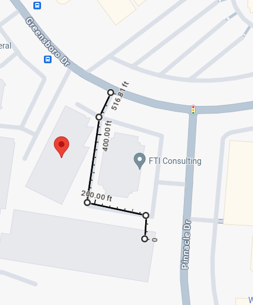
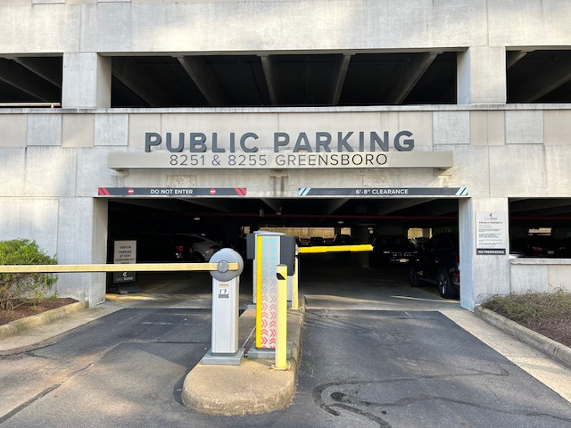

+++
title = "Meetings"
+++
NoVaLUG holds monthly, in-person meetings.

On this page:
* [Meeting Announcements](#announcements)
* [Location](#location)
* [Metro Rail Access](#metro)
* [Parking Instructions](#parking)
* [Meeting Agendas and Notes](#agendas)

# Meeting Announcements {#announcements}

Meeting announcements and notifications
can be found in the following places:

* [Meetup.com](https://www.meetup.com/novalug/)
* [Mastodon / Fediverse](https://fosstodon.org/@novalug) ([RSS](https://fosstodon.org/@novalug.rss))
* [The NoVaLUG Mailing List](https://lists.firemountain.net/pipermail/novalug/)

Past presentations from meetings can be found [here](@/presentations/_index.md).

# Location {#location}

Our monthly meetings are held at the offices of [Ridgeline International](https://www.ridgelineintl.com/), 
which is an 8 minute walk from the Greensboro Metro Station. There is also plenty of parking.

Address:

    Edwin Building
    8255 Greensboro Dr, Suite 500
    Tysons Corner, VA

Google [Map](https://maps.app.goo.gl/Khbej6vji4HrPonP7)

# Metro Rail Access {#metro}

The following map shows the **8 minute walk** from the _Greensboro Metro Station_.

# Parking {#parking}

Parking is available in the parking deck behind the Edwin Building. The deck
is labeled "Public Parking: 8251 & 8255 Greensboro".

DO NOT USE THE BOOZE-ALLEN-HAMILTON PARKING DECK.

This is a controlled parking deck, and **validated "chaser" tickets will
be available at the meeting** so participants will not be charged for parking.

# Agendas and Notes {#agendas}

Meeting agendas and notes can be found [here](/agendas).
